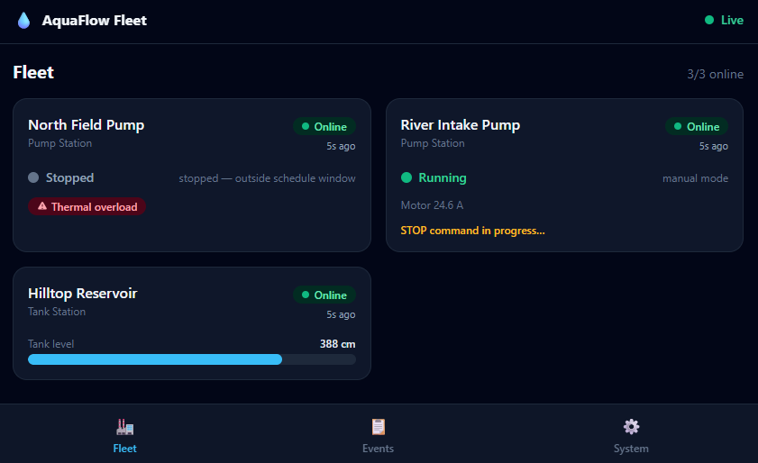

# Daniel Scioli

**SCADA & Industrial Automation Specialist — PLC, Modbus TCP, Python.**
I design, build, and operate industrial control systems that run 24/7 in real production.

For the past 8 years I've been Head of Systems & Communications at a municipal water utility in Argentina, where I built the city's entire water telemetry and control system from scratch — and still operate it today: **17 pumping stations** with remote manual/automatic control (schedule- and tank-level-driven), storage cisterns with ultrasonic level sensors, Schneider M221 PLCs programmed with EcoStruxure over Modbus TCP, and a fully custom SCADA layer (server, backend, frontend) built on Python, Linux, and Docker — plus Grafana + Prometheus for infrastructure observability (servers, network, DVRs); the SCADA layer itself is fully custom, not a dashboard skin. Currently pursuing a university degree in Cyber Defense, with focus on OT/ICS security.

## The portfolio: a complete telemetry system, in public

The production system belongs to the utility and stays private — as it should. So I rebuilt its **core architecture** from scratch as a sanitized, fictional, fully working demo you can run with one command.

The demo is deliberately a minimal skeleton. The real system it mirrors goes considerably further: a full operator web application with user management and per-role permissions, operator-configurable thresholds, schedules and alert rules (no redeploys needed), multiple report types (consumption, pump runtime and starts, incidents) with export, real-time and historical electrical telemetry (motor current and voltage) per station, audit logging of every command, and years of historical data in daily use. The register-range design also makes growth cheap: commissioning a new station is a config entry, not a project. The demo shows the architectural decisions; the depth is what I build on top of them.

| Repo | What it demonstrates |
|---|---|
| [**modbus-collector**](https://github.com/dscioli/modbus-collector) | The core: a Modbus TCP server for stations behind cellular CGNAT that *connect in* (the classic poll-the-field pattern inverted). Identity by register range, time series, control engine, alerting, REST/WS API, Prometheus metrics. |
| [**pump-station-simulator**](https://github.com/dscioli/pump-station-simulator) | The field side: a realistic PLC simulator with a physical model (tank, pump, electrical faults), scenario-driven fault injection, reconnect/backoff and reverse-watchdog behavior. One codebase, N stations. |
| [**pump-fleet-dashboard**](https://github.com/dscioli/pump-fleet-dashboard) | The operator product: an installable PWA with fleet overview, pump commands with honest pending→confirmed feedback, live levels, and the overnight event log. |
| [**industrial-monitoring-stack**](https://github.com/dscioli/industrial-monitoring-stack) | The engineering view: Prometheus + Grafana + Alertmanager pre-provisioned for OT workloads, where *silence is the signal*. |

**Run the whole simulated utility** (collector + 3 stations + Grafana + operator dashboard):

```bash
git clone https://github.com/dscioli/modbus-collector
git clone https://github.com/dscioli/pump-station-simulator
git clone https://github.com/dscioli/industrial-monitoring-stack
git clone https://github.com/dscioli/pump-fleet-dashboard
cd modbus-collector && docker compose -f docker-compose.demo.yml up --build -d
```



## How I work

Written-first, async-friendly (GMT-3, full overlap with US business hours). Detailed scoping before quoting, documented decisions, clean commented code, complete handovers. The READMEs in the repos above are a fair sample of the documentation you'd get.

📫 dscioli@nodoaustral.ar
